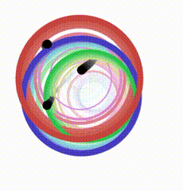

# purescript-graphics-vis

A library for interactively creating graphics visualizations in the browser using PSCi and the WebAudio and Canvas APIs.

Note: Internet Explorer and Safari are [not currently supported](https://developer.mozilla.org/en-US/docs/Web/API/MediaDevices/getUserMedia#Browser_compatibility).

## Instructions

- Install the latest (>= 0.10.2) PSCi.
- Start PSCi with the `--port` option: `pulp psci -- --port 8080`
- Open `http://localhost:8080/`
- Evaluate expressions in PSCi:

    ```text
    PSCi, version 0.10.2
    Type :? for help

    Bundling Javascript...
    Serving http://localhost:8080/. Waiting for connections...

    > import Graphics.Vis.Example
    > animate scene
    ```

- Play some music and enjoy the show!


